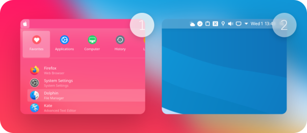
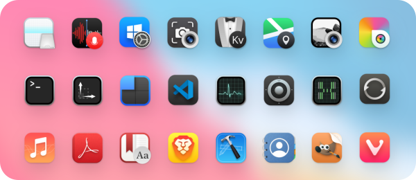
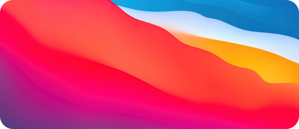
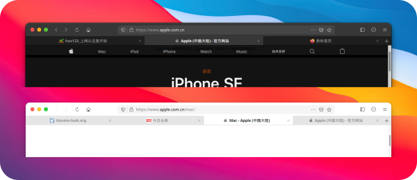
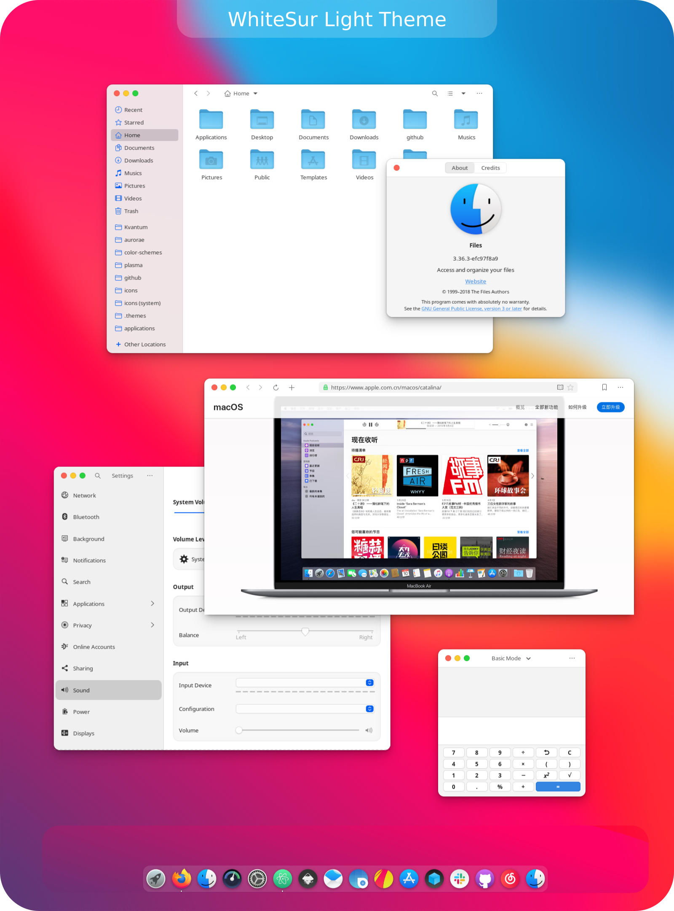

 WhiteSur Gtk Theme
======

WhiteSur is a MacOS Big Sur like theme for GTK 3, GTK 2 and Gnome-Shell which supports GTK 3 and GTK 2 based desktop environments like Gnome, Pantheon, XFCE, Mate, etc.

## Info

### GTK+ 3.20 or later

### GTK2 engines requirements
- GTK2 engine Murrine 0.98.1.1 or later.
- GTK2 pixbuf engine or the gtk(2)-engines package.

Fedora/RedHat distros:

    dnf install gtk-murrine-engine gtk2-engines

Ubuntu/Mint/Debian distros:

    sudo apt install gtk2-engines-murrine gtk2-engines-pixbuf

ArchLinux:

    pacman -S gtk-engine-murrine gtk-engines

### Installation Depends requirement
- sassc.
- optipng.
- inkscape.
- libglib2.0-dev. `ubuntu 18.04` `debian 10.03` `linux mint 19`
- libxml2-utils. `ubuntu 18.04` `debian 10.03` `linux mint 19`
- glib2-devel. `Fedora` `Redhat`

Fedora/RedHat distros:

    dnf install sassc optipng inkscape glib2-devel

Ubuntu/Mint/Debian distros:

    sudo apt install sassc optipng inkscape

Debian 10:

    sudo apt install sassc optipng inkscape libcanberra-gtk-module libglib2.0-dev libxml2-utils

ArchLinux:

    pacman -S sassc optipng inkscape

Other:
1. Search for the dependencies in your distribution's repository or install the dependencies from source.
2. For CentOS 8 users: the `sassc` package doesn't exist in EPEL 8 or any other main repositories. Download the RPM manually from older EPEL repositories or build from source.

## Installation

### From source

After all the dependencies are installed, you can Run

    ./install.sh

#### Install tips

Usage:  `./Install`  **[OPTIONS...]**

|  OPTIONS:           | |
|:--------------------|:-------------|
|-d, --dest           | Specify theme destination directory (Default: $HOME/.themes)|
|-n, --name           | Specify theme name (Default: WhiteSur)|
|-c, --color          | Specify theme color variant(s) **[light/dark]** (Default: All variants)|
|-o, --opacity        | Specify theme opacity variant(s) **[standard/solid]** (Default: All variants)|
|-a, --alt            | Specify titlebutton variant(s) **[standard/alt]** (Default: All variants)|
|-s, --size           | Run a dialg to change the nautilus sidebar width size (Default: 200px)|
|-i, --icon           | activities icon variant(s) **[standard/normal/gnome/ubuntu/arch/manjaro/fedora/debian/void]** (Default: standard variant)|
|-g, --gdm            | Install GDM theme, you should run this with sudo!|
|-r, --revert         | revert GDM theme, you should run this with sudo!|
|-h, --help           | Show this help|

If you want to change the nautilus sidebar width size, then you can run:

    ./install.sh -s

### Suggested themes
|  Suggested themes   | links | preview |
|:--------------------|:-------------|:-------------|
| Kde theme           | [WhiteSur-kde](https://github.com/vinceliuice/WhiteSur-kde)|  |
| Icon theme          | [WhiteSur-icon](https://github.com/vinceliuice/WhiteSur-icon-theme)|  |
| Wallpaper           | [WhiteSur wallpaper](https://github.com/vinceliuice/WhiteSur-kde/tree/master/wallpaper)|  |
| Firefox theme       | [WhiteSur firefox theme](src/other/firefox)|  |

## Theme Preview

