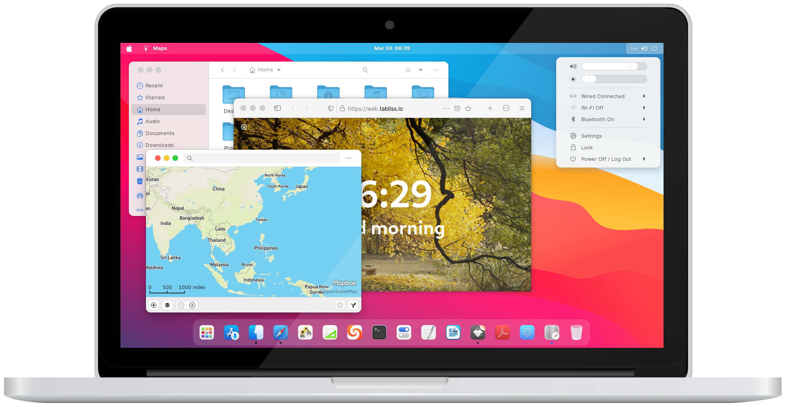
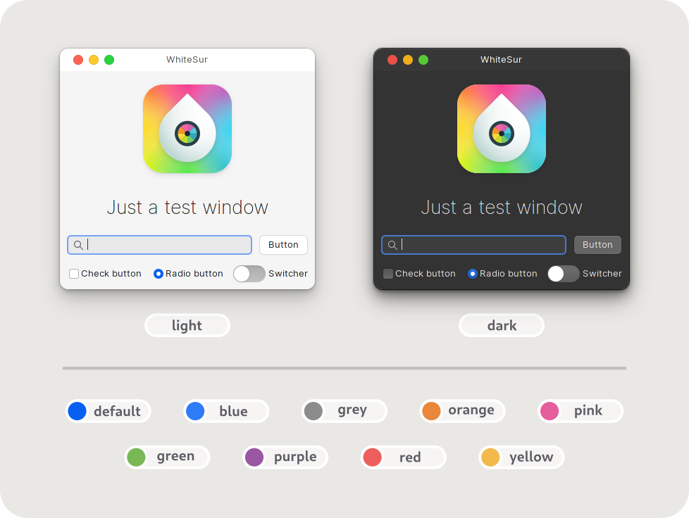
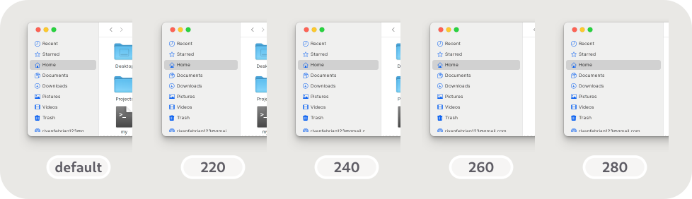
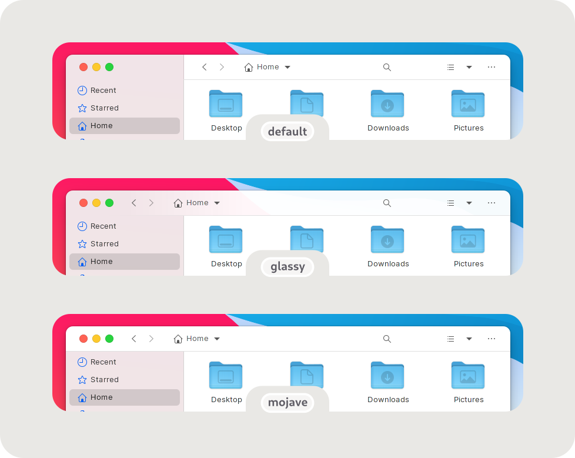

<h1 align="center"> WhiteSur GTK Theme </h1>
<p align="center">  </p>

<br>
**<p align="center"> A macOS BigSur-like theme for your GTK apps </p>**
<br>

# Installation is easy!
<details> <summary> Required dependencies info for nerds </summary>

- gtk-murrine-engine  `Fedora/RedHat`
- gtk2-engines-murrine  `Ubuntu/Mint/Debian`
- gtk-engine-murrine  `Arch/Manjaro`
- sassc
- imagemagick
- dialog
- optipng (optional for asset rendering)
- inkscape (optional for asset rendering)
- libglib2.0-dev-bin  `ubuntu 20.04`
- libglib2.0-dev  `ubuntu 18.04` `debian 10.03` `linux mint 19`
- libxml2-utils  `ubuntu 18.04` `debian 10.03` `linux mint 19`
- glib2-devel  `Fedora` `Redhat`

Don't worry, WhiteSur installer already provides all of those dependencies.
</details>

## Quick install
You can run `./install.sh` to install the default WhiteSur GTK theme pack which includes
GNOME Shell (Pantheon), Cinnamon, XFWM (XFCE), Metacity, and Plank themes.

## There's so many customizations you can do!
Usage:  `./install.sh [OPTIONS...]`

### <p align="center" > Change theme color and accent </p>
<p align="center">  </p>

#### Install theme color
Parameter: `--color` `-c` (repeatable)

Example:

```bash
./install.sh -c light          # install light theme color only
./install.sh -c dark -c light  # install dark and light theme colors
```

#### Install theme accent
Parameter: `--theme` `-t` (repeatable)

Example:

```bash
./install.sh -t red            # install red theme accent only
./install.sh -t red -t green   # install red and green theme accents
./install.sh -t all            # install all available theme accents
```

### <p align="center" > Change Nautilus sidebar minimum width </p>
<p align="center">  </p>

Parameter: `--sidebar` `-s`

Example: `./install.sh -s 220`


### <p align="center" > Change GNOME Shell 'Activities' icon </p>
<p align="center">  </p>

Parameter: `--icon` `-i`

Example: `./install.sh -i fedora`


### <p align="center" > Change Nautilus style </p>
<p align="center">  </p>

Parameter: `--nautilus-style` `-N`

Example: `./install.sh -N mojave`


### <p align="center" > Explore more customization features! </p>
You can run `./install.sh -h` to explore more customization features we have
like changing panel opacity, theme opacity (normal and solid variant), window
control button variant, etc.


# Let's tweak!
Usage:  `./tweaks.sh [OPTIONS...]`

## There's more themes you can try!
### <p align="center" > Install and edit Firefox theme </p>
<p align="center">  </p>

#### Install Firefox theme
Parameter: `--firefox` `-f`

Example: `./tweaks.sh -f`

#### Edit Firefox theme
Parameter: `--edit-firefox` `-e`

Example:

```bash
./tweaks.sh -f -e  # install and edit Firefox theme
./tweaks.sh -e -f  # it's reversible!
./tweaks.sh -e     # edit the installed Firefox theme
```

### <p align="center" > Install and customize Dash to Dock theme </p>
<p align="center">  </p>

#### Install Dash to Dock theme
Parameter: `--dash-to-dock` `-d`

Example: `./tweaks.sh -d`

#### Change its color
Parameter: `--color` `-c`

Example: `./tweaks.sh -d -c dark`

### <p align="center" > Install and customize GDM theme </p>
<p align="center">  </p>

#### Install GDM theme
Parameter: `--gdm` `-g` (requires to be ran as root)

Example: `sudo ./tweaks.sh -g`

#### Change the background
Parameter: `--background` `-b`

Example: 

```bash
sudo ./tweaks.sh -g -b "my picture.jpg" # use the custom background
sudo ./tweaks.sh -g -b default          # use the default background
sudo ./tweaks.sh -g -b blank            # make it blank
```

#### Make the background darker
Parameter: `--darken` `-D`

Example: 

```bash
sudo ./tweaks.sh -g -D                          # darken the default background
sudo ./tweaks.sh -g -D -b "wallpapers/snow.jpg" # darken the custom background
```

#### Don't blur the background
Parameter: `--no-blur` `-n`

Example: 

```bash
sudo ./tweaks.sh -g -n                           # don't blur the default background
sudo ./tweaks.sh -g -n -b "wallpapers/rocks.jpg" # don't blur the custom background
```

#### Do more GDM customizations
You can do [the similar customization features in `./install.sh`]
(#explore-more-customization-features) like changing theme color
(dark and light variant) and accent, GNOME Shell 'Activities' icon, etc.
related to GDM. Run `./tweaks.sh -h` to explore!

## Using WhiteSur theme on app sandboxing platforms
<p align="center">  </p>

### <p align="center" > Connect WhiteSur theme to Flatpak </p>
Parameter: `--flatpak` `-F`

Example: `./tweaks.sh -F`

### <p align="center" > Connect WhiteSur theme to your Snap apps </p>
Parameter: `--snap` `-S`

Example: `./tweaks.sh -S`

Note:

> This can only connect WhiteSur theme to your currently installed Snap
> apps. You may need to run this command again to connect to your newly installed
> Snap apps

# Other recommended stuffs
## Whitesur KDE Theme
<p align="center"> <a href="https://github.com/vinceliuice/WhiteSur-kde">
	

	<br><br>

	
</a> </p>

## Whitesur Icon Theme
<p align="center"> <a href="https://github.com/vinceliuice/WhiteSur-icon-theme">
	

	<br><br>

	
</a> </p>

## Whitesur Wallpaper
<p align="center"> <a href="https://github.com/vinceliuice/WhiteSur-kde/tree/master/wallpaper">
	

	<br><br>

	
</a> </p>
<br>
# Technical details and getting involved
Please go read [CONTRIBUTING.md](CONTRIBUTING.md) for more info
