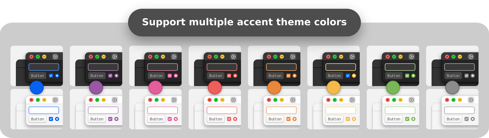
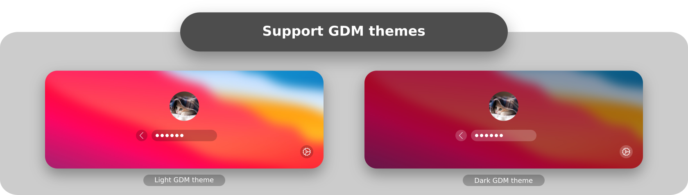
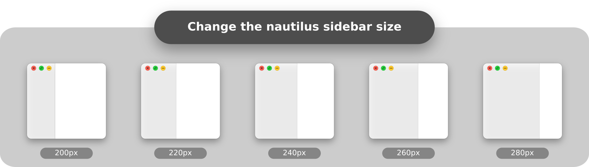
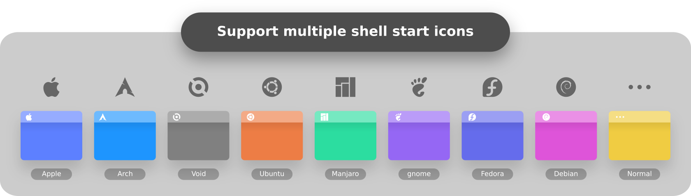
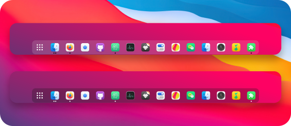

 WhiteSur Gtk Theme
======

WhiteSur is a MacOS Big Sur like theme for GTK 3, GTK 2 and Gnome-Shell which supports GTK 3 and GTK 2 based desktop environments like Gnome, Pantheon, XFCE, Mate, etc.

## Requirements
### GTK2 Murrine engine requirement.

- gtk-murrine-engine  `Fedora/RedHat`
- gtk2-engines-murrine  `Ubuntu/Mint/Debian`
- gtk-engine-murrine  `Arch/Manjaro`

### GTK2 pixbuf engine requirement.

- gtk2-engines  `Fedora/RedHat`
- gtk2-engines-pixbuf  `Ubuntu/Mint/Debian`
- gtk-engines  `Arch/Manjaro`

### Installation Depends requirement

- sassc
- optipng
- inkscape
- dialog
- libglib2.0-dev-bin  `ubuntu 20.04`
- libglib2.0-dev  `ubuntu 18.04` `debian 10.03` `linux mint 19`
- libxml2-utils  `ubuntu 18.04` `debian 10.03` `linux mint 19`
- glib2-devel  `Fedora` `Redhat`

## Installation

### From source

After all the dependencies are installed, you can Run

    ./install.sh

#### Install tips

Usage:  `./Install`  **[OPTIONS...]**

|  OPTIONS:           | |
|:--------------------|:-------------|
|-d, --dest           | Specify theme destination directory (Default: $HOME/.themes)|
|-n, --name           | Specify theme name (Default: WhiteSur)|
|-c, --color          | Specify theme color variant(s) **[light/dark]** (Default: All variants)|
|-o, --opacity        | Specify theme opacity variant(s) **[standard/solid]** (Default: All variants)|
|-a, --alt            | Specify titlebutton variant(s) **[standard/alt]** (Default: All variants)|
|-t, --theme          | Run a terminal dialog to change the theme accent color (Default: blue)|
|-p, --panel          | Run a terminal dialog to change the panel transparency (Default: 85%)|
|-s, --size           | Run a terminal dialog to change the nautilus sidebar width size (Default: 200px)|
|-i, --icon           | activities icon variant(s) **[standard/normal/gnome/ubuntu/arch/manjaro/fedora/debian/void]** (Default: standard variant)|
|-g, --gdm            | Install GDM theme, you should run this with sudo!|
|-r, --remove         | remove theme, this will remove all installed themes!|
|-h, --help           | Show this help|

### <p align="center" > 1. Change theme accent color </p>
If you want to change theme accent! (Default color is blue)
then you can run: ( `dialog` is required, install it first! )

    ./install.sh -t



### <p align="center" > 2. Install GDM theme </p>
If you want to install GDM theme!
then you can run:

    ./install.sh -g      (install default dark version)

    ./install.sh -g -c light     (install light version)

    ./install.sh -g -r     (remove installed GDM theme)



### <p align="center" > 3. Change nautilus sidebar width size </p>
If you want to change nautilus sidebar width size! (Default size is 180px)
(Nautilus cannot change the structure of the sidebar, so I added a picture as a background to achieve the effect of bigsur)
then you can run: ( `dialog` is required, install it first! )

    ./install.sh -s



### <p align="center" > 4. Change gnome-shell activities icon </p>
If you want to change gnome-shell activities icon! (Default icon is Apple)
then you can run: (For example: Install Manjaro icon)

    ./install.sh -i manjaro



### On Snapcraft

<a href="https://snapcraft.io/whitesur-gtk-theme">

</a>

You can install the theme from the Snap Store оr by running:

```
sudo snap install whitesur-gtk-theme
```
To connect the theme to an app run:
```
sudo snap connect [other snap]:gtk-3-themes whitesur-gtk-theme:gtk-3-themes
```
```
sudo snap connect [other snap]:icon-themes whitesur-gtk-theme:icon-themes
```
To connect the theme to all apps which have available plugs to gtk-common-themes you can run:
```
for i in $(snap connections | grep gtk-common-themes:gtk-3-themes | awk '{print $2}'); do sudo snap connect $i whitesur-gtk-theme:gtk-3-themes; done
```

### Suggested themes
|  Suggested themes   | links | preview |
|:--------------------|:-------------|:-------------|
| Kde theme           | [WhiteSur-kde](https://github.com/vinceliuice/WhiteSur-kde)|  |
| Icon theme          | [WhiteSur-icon](https://github.com/vinceliuice/WhiteSur-icon-theme)|  |
| Wallpaper           | [WhiteSur wallpaper](https://github.com/vinceliuice/WhiteSur-kde/tree/master/wallpaper)|  |
| Firefox theme       | [WhiteSur firefox theme](src/other/firefox)|  |
| Dash to Dock theme  | [WhiteSur dash-to-dock theme](src/other/dash-to-dock)|  |

## Theme Preview

